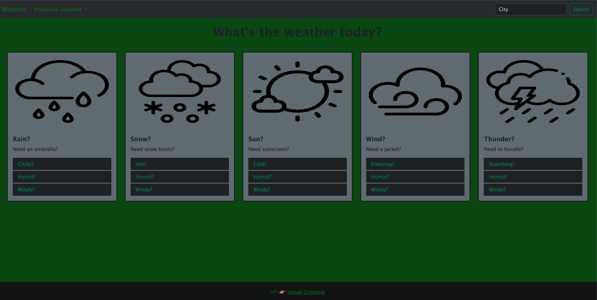

# 06-Weather-Dashboard

LIVE URL 👇🏼 

## Description

My motivation to complete this was from having already completed project 1. This made me feel confident with how I can access data from the API and plug it in wherever needed. I built this to solidify my understanding with not only API's, but javascriot, jquery, css, html & bootstrap. This allows users to access a website where they can easily search weather anywhere in the world with a user friendly interface. I learned that the simplest fix could be making sure you add the correct class to every element, after you have stared at your code for an hour wondering why it wasn't working!😅

## Installation

N/A

## Usage

Home page to the weather dashboard 
 
 
First you want to go to the search input in the nav bar 
 
 
On the right, there is an input for the city and search button 
 
 
Enter in city you'd like to see current & future weather for 
 
 
After you click search, it will bring up the current conditions for that city & below the 5 day forecast 
 
 
 
 

## Credits

Thank you to my tutor Andrew, who refreshed my memory after a christmas break. 

https://www.w3schools.com/jquery/sel_eq.asp#:~:text=The%20%3Aeq()%20selector%20selects,like%20in%20the%20example%20above

Rain Icon
<a href="https://www.flaticon.com/free-icons/rain" title="rain icons">Rain icons created by tulpahn - Flaticon</a>
 
Snow Icon
<a href="https://www.flaticon.com/free-icons/snowing" title="snowing icons">Snowing icons created by Freepik - Flaticon</a>
 
Sun Icon
<a href="https://www.flaticon.com/free-icons/sunny" title="sunny icons">Sunny icons created by fjstudio - Flaticon</a>
 
Wind Icon
<a href="https://www.flaticon.com/free-icons/windy" title="windy icons">Windy icons created by Freepik - Flaticon</a>
 
Thunder Icon
<a href="https://www.flaticon.com/free-icons/weather" title="weather icons">Weather icons created by Freepik - Flaticon</a>
 
Cloud Icon
<a href="https://www.flaticon.com/free-icons/cloudy" title="cloudy icons">Cloudy icons created by Freepik - Flaticon</a>
 
Partly Cloudy Icon
<a href="https://www.flaticon.com/free-icons/cloudy" title="cloudy icons">Cloudy icons created by kosonicon - Flaticon</a>
 
Fog Icon
<a href="https://www.flaticon.com/free-icons/misty" title="misty icons">Misty icons created by Muhamad Ulum - Flaticon</a>

## License

The MIT License is short and to the point. It lets people do almost anything they want with your project, like making and distributing closed source versions

---

🏆 The previous sections are the bare minimum, and your project will ultimately determine the content of this document. You might also want to consider adding the following sections.

## Badges

N/A

## Features

N/A

## How to Contribute

N/A

## Tests

Look up the weather for any city you can think of! See #Usage for more info on how!